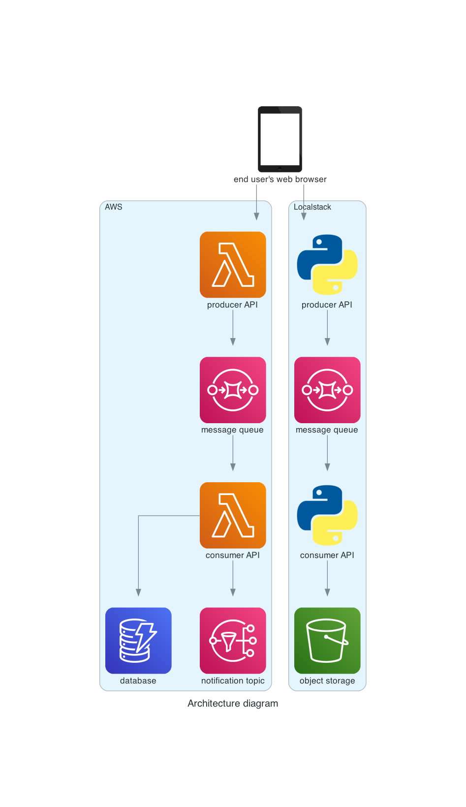

# aws-serverless-rest-api

AWS serverless REST API provisioned automatically by Terraform, based mainly on [AWS Free Tier](https://aws.amazon.com/free/).

## Prerequisites

* Install tools:
  * [Terraform](https://learn.hashicorp.com/tutorials/terraform/install-cli)
  * [AWS CLI](https://docs.aws.amazon.com/cli/latest/userguide/getting-started-install.html)
  * [LocalStack](https://docs.localstack.cloud/get-started/#localstack-cli)

* Start Localstack:

```
localstack start
```

* Configure AWS CLI to use Localstack:

```
aws configure --profile localstack

AWS Access Key ID [None]: test
AWS Secret Access Key [None]: test
Default region name [None]: us-east-1
Default output format [None]:
```

## Design



If you want to regenerate architecture diagram from code, use below commands:

```
cd design

python3 -m venv venv
source venv/bin/activate
pip install -r requirements.txt

python architecture_diagram.py
```

## Infrastructure

Whole infrastructure code can be deployed using below commands. Remember to pass correct AWS access key and secret for your account. After deployment in output from Terraform you can find all details how to access ALB or bastion hosts:

```
cd infra

terraform init
terraform plan
terraform apply -auto-approve
terraform output
```

Command to manually check Lamdba, S3, DynamoDB, SNS and SQS:

```
aws --endpoint-url=http://localhost:4566 lambda list-functions
aws --endpoint-url=http://localhost:4566 s3 ls
aws --endpoint-url=http://localhost:4566 s3 ls s3://localstack-s3-serverless-rest-api
aws --endpoint-url=http://localhost:4566 dynamodb list-tables
aws --endpoint-url=http://localhost:4566 sns list-topics
aws --endpoint-url=http://localhost:4566 sqs list-queues
```

## Application

If you want to execute whole application by calling Lamdba function, use below Python code:

```
cd app

python3 -m venv venv
source venv/bin/activate
pip install -r requirements.txt

python lambda_function_url_iam_auth.py
```
