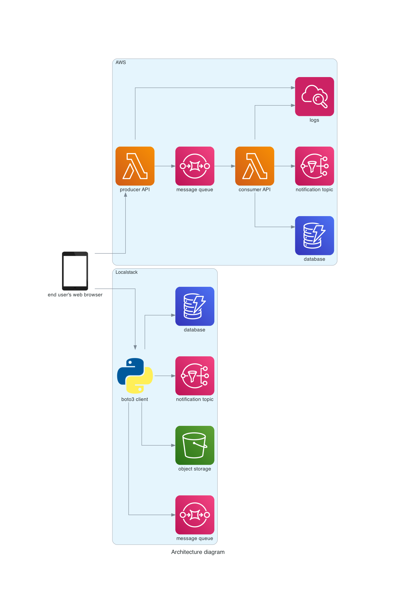

# AWS serverless REST API

AWS serverless REST API provisioned automatically by Terraform, based mainly on [AWS Free Tier](https://aws.amazon.com/free/).

## Prerequisites

* Install tools:
  * [Terraform](https://learn.hashicorp.com/tutorials/terraform/install-cli)
  * [AWS CLI](https://docs.aws.amazon.com/cli/latest/userguide/getting-started-install.html)
  * [LocalStack](https://docs.localstack.cloud/get-started/#localstack-cli)

* Start Localstack:

```
localstack start
```

* Configure AWS CLI to use Localstack:

```
aws configure --profile localstack

AWS Access Key ID [None]: test
AWS Secret Access Key [None]: test
Default region name [None]: us-east-1
Default output format [None]:
```

## Design



If you want to regenerate architecture diagram from code, use below commands:

```
cd design

python3 -m venv venv
source venv/bin/activate
pip install -r requirements.txt

python architecture_diagram.py
```

## Infrastructure

Whole infrastructure code can be deployed using below commands. Remember to pass correct AWS access key and secret for your account. After deployment in output from Terraform you can find all details how to access ALB or bastion hosts:

```
cd infra

terraform init
terraform plan
terraform apply -auto-approve
terraform output
```

Command to manually check Lamdba, S3, DynamoDB, SNS and SQS:

```
aws --endpoint-url=http://localhost:4566 lambda list-functions
aws --endpoint-url=http://localhost:4566 s3 ls
aws --endpoint-url=http://localhost:4566 s3 ls s3://localstack-s3-serverless-rest-api
aws --endpoint-url=http://localhost:4566 dynamodb list-tables
aws --endpoint-url=http://localhost:4566 sns list-topics
aws --endpoint-url=http://localhost:4566 sqs list-queues

aws lambda list-functions
aws dynamodb list-tables
aws sns list-topics
aws sqs list-queues
```

In infrastructure code there was used one feature available from 1.5-beta version of Terraform - check {} block, which was used in [producer Lambda to verify deployment](infra/compute_producer.tf):

```terraform
check "lambda_deployed" {
  data "external" "this" {
    program = ["curl", "${aws_lambda_function_url.lambda_producer_endpoint.function_url}"]
  }

  assert {
    # If we execution function using URL without authentication, then it should be received forbidden message, if Lambda is deployed correctly
    condition = data.external.this.result.Message == "Forbidden"
    error_message = format("The Lambda %s is not deployed.",
      aws_lambda_function.lambda_producer.function_name
    )
  }
}
```

Here there are successful results of checks:

```
Terraform will perform the following actions:

  # data.external.this will be read during apply
  # (config will be reloaded to verify a check block)
 <= data "external" "this" {
      + id      = "-"
      + program = [
          + "curl",
          + "https://7nd44kore5shut24s5v5up5aa40ibndl.lambda-url.us-east-1.on.aws/",
        ]
      + result  = {
          + "Message" = "Forbidden"
        }
    }

Plan: 0 to add, 0 to change, 0 to destroy.

Do you want to perform these actions?
  Terraform will perform the actions described above.
  Only 'yes' will be accepted to approve.

  Enter a value: yes

data.external.this: Reading...
data.external.this: Read complete after 1s [id=-]

Apply complete! Resources: 0 added, 0 changed, 0 destroyed.
```

Moreover there were added tests available from 1.6 version of Terraform - there is defined 1 test [for producer Lambda](infra/compute_producer.tftest.hcl):

```hcl
run "check_producer_lambda_url" {

  command = apply

  variables {
    prefix = "test"
  }

  assert {
    condition     = length(aws_lambda_function_url.lambda_producer_endpoint.function_url) > 0
    error_message = "Lambda producer URL should not be empty"
  }

}
```

Here there are successful results of tests:

```
$ terraform test
compute_producer.tftest.hcl... in progress
  run "check_producer_lambda_url"... pass
compute_producer.tftest.hcl... tearing down
compute_producer.tftest.hcl... pass

Success! 1 passed, 0 failed.
```

## Application

If you want to execute whole application by calling Lamdba function, you can use:

1. editor in AWS Lambda web page and test function
2. Postman with configured AWS authorization
3. below Python code:

```
cd app

python3 -m venv venv
source venv/bin/activate
pip install -r requirements.txt

source export_aws_secrets.sh
python aws_lambda_function_url_iam_auth_get.py
python aws_lambda_function_url_iam_auth_post.py
```

In order to check localstack with DynamoDB, SNS, SQS or S3, you can use script:

```
python localstack_dynamodb_s3_sqs_sns.py
```
